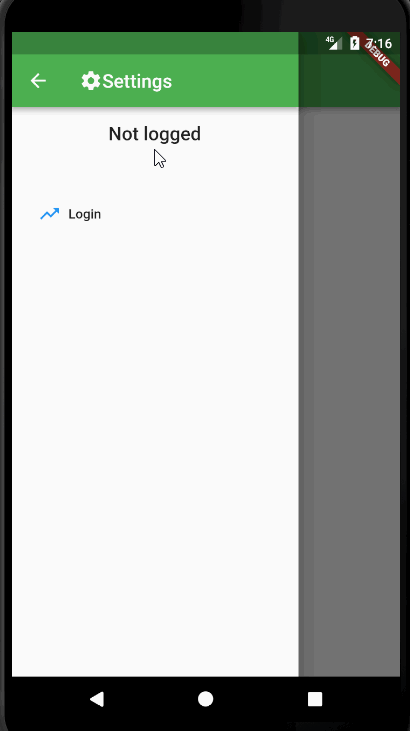

# info_scanner_mobile

Dart + Flutter project for Android and IOS mobiles
 This is a next step for InfoScanner project
 I'm planning to build 2 apps, which will help for embroiderers such as my wife
 Both of apps can synchronize to each other and can store local own data

<<<<<<< HEAD
## Getting Started

for generating models I used this site: https://app.quicktype.io/#l=dart

use kiwi.dart for DI. To generate Injector class use kiwi_generator(console: flutter packages pub run build_runner build)
=======

>>>>>>> a8d3a5a... + gif edit link
